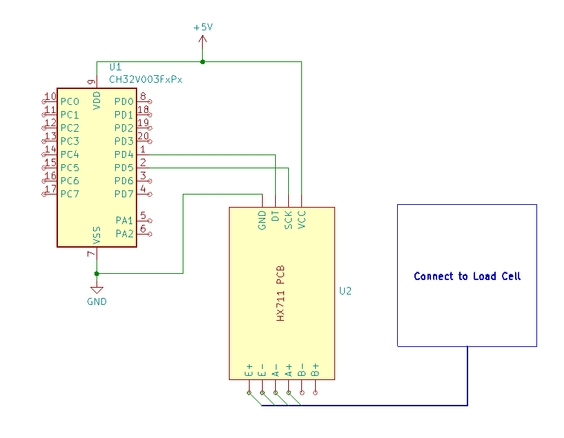

# HX711 Load Cell Amplifier

This example shows how to interface a HX711 load cell amplifier for integrating a weighing scale into your project.
The project provides a simple interface for calibration and reading weight values over the debug interface.

## Hardware Connections

- **HX711 can be connected to 5V or 3V3, 5V might give more stable results**
- **HX711 Data Pin (DT):** Connect to `PD4` (can be changed using define `HX711_DATA_PIN`).
- **HX711 Clock Pin (SCK):** Connect to `PD5` (can be changed using define `HX711_CLK_PIN`).^
- **HX711 E+/E-/A-/A+:** Connect to single load cell, two load cells (half wheatstone bridge) or four load cells (full wheatstone bridge)

### Schematic

*The generic "green" HX711 PCBs sometimes don't have connected GND to E-. To improve measurements, you can just bridge E- and GND together.*

## Usage

1. Use `make` to upload firmware and `make monitor` to open the terminal
1. On startup, the device will tare (zero) the scale.
2. Enter commands:
   - `C` + Enter: Starts calibration. Follow the three prompts to place a known weight and enter its value.
   - `V` + Enter: Reads and displays the current weight value.